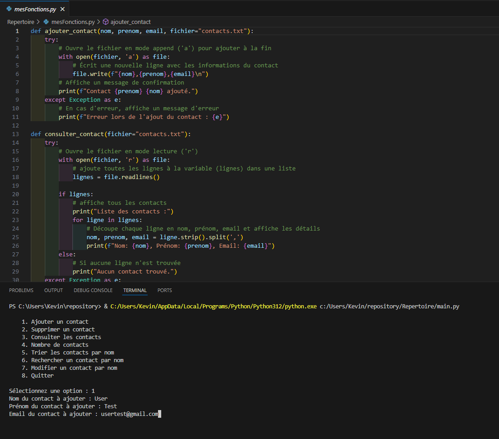

## Création d'un répertoire en python.
- Mise en place d'un menu de navigation
- Mise en place de fonctions pour les différentes fonctionnalités
- Ecriture d'un fichier .txt afin de gerer la base de donnée
- Ecriture, suppression, modification, recherche au sein du .txt

